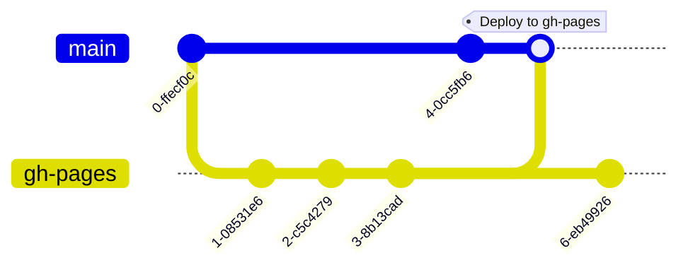
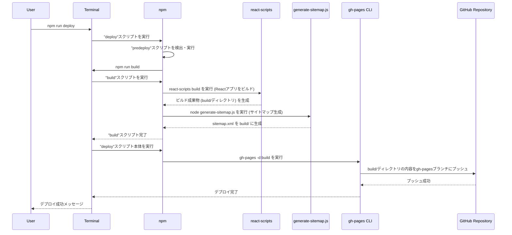

### Gitブランチの関係性: `main` と `gh-pages`

GitHub Pages を利用してウェブサイトを公開する場合、通常、2つの主要なブランチが関与します。

1.  **`main` ブランチ (または `master`)**:
    *   これはプロジェクトの**ソースコード**を管理するための主要な開発ブランチです。
    *   Reactアプリケーションの場合、`src/`ディレクトリ内の`.tsx`、`.ts`、`.css`ファイル、`public/`ディレクトリ内の静的アセット、`package.json`などの開発ファイルがここに存在します。
    *   開発者はこのブランチでコードを書き、変更をコミットし、プッシュします。

2.  **`gh-pages` ブランチ**:
    *   これは GitHub Pages が**ウェブサイトとして公開する静的ファイル**を格納するための特別なブランチです。
    *   このブランチには、通常、Reactアプリケーションのビルドプロセスによって生成された最適化されたHTML、CSS、JavaScriptファイル（`build/`ディレクトリの内容）が含まれます。
    *   **重要**: `gh-pages`ブランチにはソースコードは含まれず、公開されるウェブサイトの最終的な成果物のみが含まれます。

**関係性**:`main`ブランチで開発を行い、アプリケーションをビルドすると、その成果物が`gh-pages`ブランチにプッシュされ、ウェブサイトとして公開されます。



### `npm run deploy` の仕組み

`package.json`に定義されている`deploy`スクリプトは、GitHub Pagesへのデプロイプロセスを自動化するためのものです。その仕組みは以下のステップで構成されます。

```json
"scripts": {
  "build": "react-scripts build && node generate-sitemap.js",
  "predeploy": "npm run build",
  "deploy": "gh-pages -d build"
}
```

#### シーケンス図



#### 各ステップの詳細

1.  **`npm run deploy` の実行**:
    *   ユーザーが`npm run deploy`コマンドを実行すると、`npm`は`package.json`内の`scripts`セクションを探します。

2.  **`predeploy` スクリプトの自動実行**:
    *   `npm`は、`deploy`スクリプトの前に`predeploy`という名前のスクリプトが存在することを確認し、自動的にそれを実行します。
    *   この場合、`"predeploy": "npm run build"`が実行されます。これは、デプロイする前に必ずアプリケーションを最新の状態でビルドすることを保証します。

3.  **`build` スクリプトの実行**:
    *   `npm run build`が実行されると、`"build": "react-scripts build && node generate-sitemap.js"`が実行されます。
    *   **`react-scripts build`**:
        *   これはCreate React App (CRA) が提供するコマンドで、Reactアプリケーションのソースコード（`src/`ディレクトリ内のJSX/TSX、CSS、画像など）を本番環境用に最適化された静的ファイル（HTML、CSS、JavaScript、画像など）にコンパイルします。
        *   これらの最適化されたファイルは、通常、プロジェクトのルートにある`build/`ディレクトリに生成されます。
        *   このステップでは、コードのトランスパイル（TypeScriptからJavaScriptへ）、バンドル、ミニファイ（圧縮）、アセットの最適化などが行われます。
    *   **`&& node generate-sitemap.js`**:
        *   `&&`は、前のコマンド（`react-scripts build`）が成功した場合にのみ、次のコマンドを実行するという意味です。
        *   `node generate-sitemap.js`は、`generate-sitemap.js`というNode.jsスクリプトを実行します。このスクリプトは、ウェブサイトの構造を記述した`sitemap.xml`ファイルを生成し、これも`build/`ディレクトリに配置されます。これはSEO（検索エンジン最適化）のために重要です。

4.  **`deploy` スクリプト本体の実行**:
    *   `predeploy`スクリプト（つまり`build`スクリプト）が正常に完了すると、`npm`は`deploy`スクリプト本体である`"deploy": "gh-pages -d build"`を実行します。
    *   **`gh-pages -d build`**:
        *   `gh-pages`は、指定されたディレクトリ（`-d build`で`build/`ディレクトリを指定）の内容を、GitHubリポジトリの`gh-pages`ブランチにプッシュするためのコマンドラインツールです。
        *   このツールは、`build/`ディレクトリの内容を一時的にGitリポジトリとして扱い、`gh-pages`ブランチにコミットしてプッシュします。
        *   これにより、`build/`ディレクトリ内の静的ファイルがGitHub Pagesによってホストされ、ウェブサイトとして公開されます。

この一連のプロセスにより、開発者は`main`ブランチでアプリケーションのソースコードを管理しつつ、`npm run deploy`コマンド一つで、最適化されたビルド成果物を`gh-pages`ブランチに自動的にデプロイし、ウェブサイトを更新することができます。