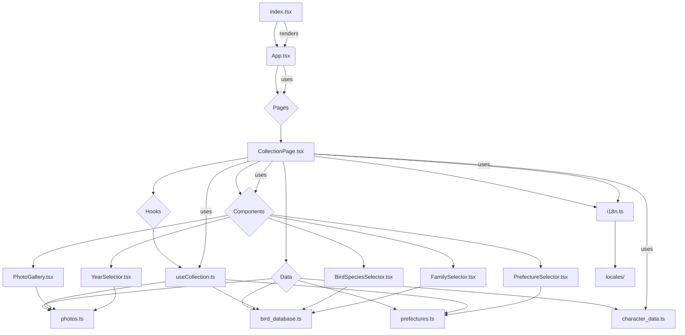
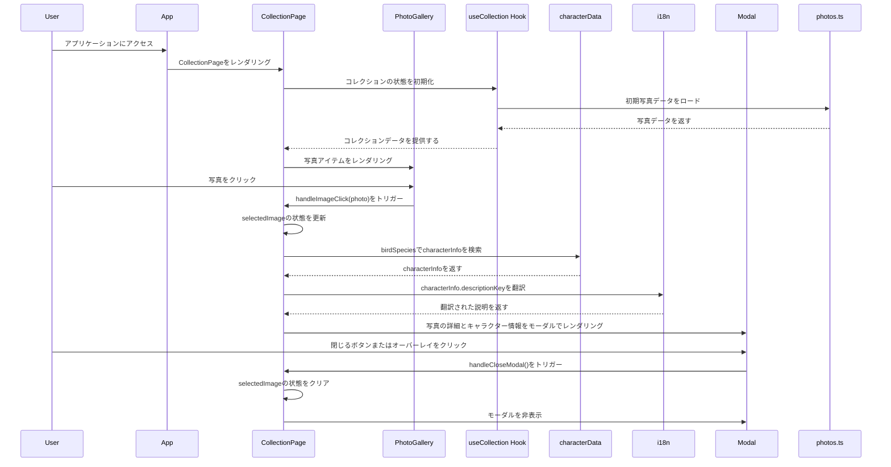

## アプリケーションの全体構成図

```mermaid
graph TD
    A[index.tsx] --> B(App.tsx)
    B --> C{Pages}
    C --> D[CollectionPage.tsx]
    D --> E{Components}
    E --> F[PhotoGallery.tsx]
    E --> G[BirdSpeciesSelector.tsx]
    E --> H[PrefectureSelector.tsx]
    E --> I[FamilySelector.tsx]
    E --> J[YearSelector.tsx]
    D --> K{Hooks}
    K --> L[useCollection.ts]
    D --> M{Data}
    M --> N[character_data.ts]
    M --> O[bird_database.ts]
    M --> P[photos.ts]
    M --> Q[prefectures.ts]
    D --> R[i18n.ts]
    R --> S[locales/]
    L --> P
    L --> Q
    L --> O
    F --> P
    G --> O
    H --> Q
    I --> O
    J --> P
    D -- uses --> R
    D -- uses --> L
    D -- uses --> N
    D -- uses --> E
    B -- uses --> C
    A -- renders --> B
```

## シーケンス図

```mermaid
sequenceDiagram
    participant User
    participant App
    participant CollectionPage
    participant PhotoGallery
    participant useCollection Hook
    participant characterData
    participant i18n
    participant Modal

    User->>App: アプリケーションにアクセス
    App->>CollectionPage: CollectionPageをレンダリング
    CollectionPage->>useCollection Hook: コレクションの状態を初期化
    useCollection Hook->>photos.ts: 初期写真データをロード
    photos.ts-->>useCollection Hook: 写真データを返す
    useCollection Hook-->>CollectionPage: コレクションデータを提供する
    CollectionPage->>PhotoGallery: 写真アイテムをレンダリング
    User->>PhotoGallery: 写真をクリック
    PhotoGallery->>CollectionPage: handleImageClick(photo)をトリガー
    CollectionPage->>CollectionPage: selectedImageの状態を更新
    CollectionPage->>characterData: birdSpeciesでcharacterInfoを検索
    characterData-->>CollectionPage: characterInfoを返す
    CollectionPage->>i18n: characterInfo.descriptionKeyを翻訳
    i18n-->>CollectionPage: 翻訳された説明を返す
    CollectionPage->>Modal: 写真の詳細とキャラクター情報をモーダルでレンダリング
    User->>Modal: 閉じるボタンまたはオーバーレイをクリック
    Modal->>CollectionPage: handleCloseModal()をトリガー
    CollectionPage->>CollectionPage: selectedImageの状態をクリア
    CollectionPage->>Modal: モーダルを非表示
```